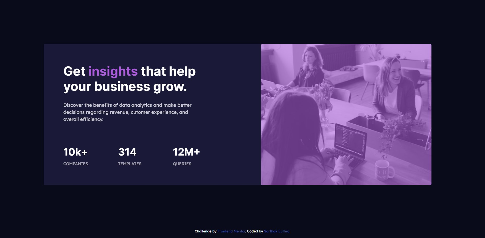

# Frontend Mentor - Stats preview card component solution

This is a solution to the [Stats preview card component challenge on Frontend Mentor](https://www.frontendmentor.io/challenges/stats-preview-card-component-8JqbgoU62). Frontend Mentor challenges help you improve your coding skills by building realistic projects.

## Table of contents

- [The challenge](#the-challenge)
- [Screenshot](#screenshot)
- [Links](#links)
- [My process](#my-process)
- [Built with](#built-with)
- [Useful resources](#useful-resources)
- [Author](#author)

### The challenge

Challenge is to build out the card component and get it looking as close to the design as possible. You should build out the project to the designs provided. You will find both a mobile and a desktop version of the design.
Users should be able to view the optimal layout depending on their device's screen size.

### Screenshot

### Links

- Solution URL: https://sarthak-21.github.io/stats-preview-card-component/

## My process

- Created the structure required for the card component. (HTML)
- Added background color and font colors.
- Given some padding and margins to elements based on my judgement.
- Made it mobile-friendly.
- Added animation.

### Built with

- Semantic HTML5 markup
- CSS custom properties
- CSS Grid
- Bootstrap 4.6.1
- Google fonts

### Useful resources

- [Bootstrap 4.6.1 display property](https://getbootstrap.com/docs/4.6/utilities/display/) - For controlling display (hiding certain elements)
- [Google Fonts]() - Fonts from here.
- [Animations](https://michalsnik.github.io/aos/) - Animation on scroll library

## Author

- Website - [Sarthak Luthra](https://sarthak-21.github.io/My-personal-site/)
- Frontend Mentor - [@sarthak-21](https://www.frontendmentor.io/profile/sarthak-21)
